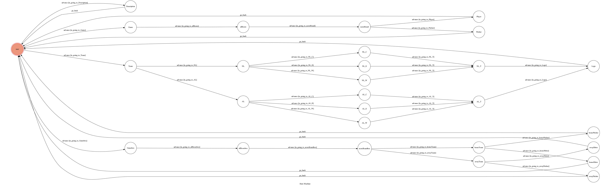

# TOC-final_project

Template Code for TOC Project 2019

A Facebook messenger bot based on a finite state machine

My fb messenger chatbot is a real time baseball game

可以用來
1.查詢某天的MLB棒球比賽成績
2.連結到球隊的官網
3.查詢某天比賽主客場球隊的投手或打者的詳細表現數據

## Setup

### Prerequisite
* Python 3
* Facebook Page and App
* HTTPS Server

#### Install Dependency
```sh
pip3 install -r requirements.txt
pip3 install mlbgame
pip3 install lxml
```

#### Run the sever

```sh
python3 app.py
```

## Finite State Machine


## Usage
The initial state is set to `user`.

Every time `user` state is triggered to `advance` to another state, it will `go_back` to `user` state after the bot replies corresponding message.

```sh
第一個sequence : 簡單介紹其他三個sequence的功能     input : hi
第二個sequence : 查詢指定日期的比賽成績             input : game
第三個sequence : 獲得MLB官網,球隊官網,球隊logo      input : team
第四個sequence : 查詢指定日期的選手表現數據          input : box
```

* user
    * 1.這個sequence是用來簡單解釋以下三種input可以得到的功能
	    * Input: "hi"
        * state: Description
    		* Reply: "Welcome to my Baseball Chatbot"

                    1.If you want to get the result of the game in a day you choose :
                    Please enter 'game'
                    2.If you want to get the players performance which is at the day you choose
                    Please enter 'box'
                    3.If you want to go to the official site and get ball team logo
                    Please enter 'team'
                    back to user and getting start by enter :
                    'game', 'box', 'team'

    * 2.這個sequence可以輸入一個日期(例:2018 10 23)就可以查詢當天所有比賽的成績,接下來輸入其中一隊的主隊隊名,就可以得到該場比賽的記分板
        接下來可以輸入"pitcher" 可以得到該場比賽的勝投與敗投
        接下來可以輸入"player" 可以得到該場比賽的主隊選手出場名單
	    * Input: "game"
        * state : Game
		    * Reply: "Game Score mode :"
                     "Please enter the day and follow the following rules to get the ball games result at your enter day :"
                     "years from 2005 to 2018"
                     "month from 3 to 11"
                     "(format : xxxx xx xx)"
        * Input: "例如 : 2018 10 23"
        * state : allScore
            * reply: 
                     輸入日期格式錯誤或該日期沒有比賽:
                     "your chosen day had no game"
                     "please enter another day again!"

                     輸入的日期正確且該日期有比賽:
                     "Game Score mode :"
                     "this is the ball game result at your chosen day :"

                     "Dodgers (4) at Red Sox (8) => (客隊 (比數) at 主隊 (比數))"
                     
                     "Please enter the name of home team(the rear team show as above result) to get the game scoreboard :"
        * Input: "例如 : Red Sox" (需要輸入的隊伍名稱為上面比賽結果中的主隊"Red Sox")
        * state : scoreBoard
            * Reply: 
                     若輸入的隊伍名稱不是主隊或隊伍名稱錯誤：
                     "your entered home team name is false"
                     "please reenter again!"

                     若輸入的隊伍名字是主隊且正確:
                     "Game Score mode :"
                     "this is the scoreboard of a team you choose :"

                     例:

                     Inning 1   2   3   4   5   6   7   8   9   F
                     Away   0   1   1   0   1   0   1   0   0   4
                     Home   2   0   1   0   2   0   3   0   0   8

                     "if you want to view win/lose pitcher :"
                     "please enter 'pitcher'"
                     "And if you want to view the home team player list :"
                     "please enter 'player'"
            * Input: "pitcher"
            * state: Pitcher
                * Reply: "Game Score mode :"
                         "This is the game's win/lose pitcher :"

                         例:
                         Winning pitcher: Matt Barnes (Red Sox) - 
                         Losing Pitcher: Clayton Kershaw (Dodgers)

                         "Thanks for using"   -------->  此步即結束此sequence,回到user state
            * Input: "player"
            * state: Player
                * Reply: "Game Score mode :"
                         "This is the home team's player list :"

                         例:
                         Mookie Betts (RF)
                         Andrew Benintendi (LF)
                         Steve Pearce (1B)
                         Mitch Moreland (PH-1B)
                         J.D. Martinez (DH)
                         Xander Bogaerts (SS)
                         Rafael Devers (3B)
                         Eduardo Nunez (PH-3B)
                         Ian Kinsler (2B)
                         Sandy Leon (C)
                         Jackie Bradley Jr. (CF)
                         Chris Sale (P)
                         Matt Barnes (P)
                         Joe Kelly (P)
                         Ryan Brasier (P)
                         Eduardo Rodriguez (P)
                         Nathan Eovaldi (P)
                         Craig Kimbrel (P)

                         "Thanks for using"   -------->  此步即結束此sequence,回到user state

    * 3.這個sequence是用來查詢球隊資料,最後可獲得球隊logo or MLB官網 or 各球隊的官網
        * Input: "team"
        * state: Team
            * Reply: "choose AL or NL to see the league of team"
                     and has two button to choose "AL" or "NL"
        * Input: button "AL" or "NL"
        * state: AL or NL
            * Reply: "choose the region of your team in AL or NL"
                     and has three button to choose "WEST" or "CENTRAL" or "EAST"
        * Input: button "WEST" or "CENTRAL" or "EAST"
        * state: AL_W or AL_C or AL_E or NL_W or NL_C or NL_E
            * Reply: 
                     例:
                        Enter the team you want to see :
                        Angels
                        Astros
                        Rangers
                        Mariners
                        Athletics
        
        * Input: "例如 : Astros"
        * state: NL_T or AL_T
            * Reply: "choose the one to get next(Official Site or Logo)"
                     and has three button
                     

                    1. go to Official Site                      => 可以連結到該輸入球隊的官網
                    2. MLB Official Site                        => 可以連結到MLB的官網
                    3. get Logo and back(go to state "Logo")    => 接收到該球隊的Logo image and go back to user state
                        -------->  此步即結束此sequence,回到user state


    * 4.這個sequence是用來查詢某天比賽,主客場球隊的投手或打者的詳細比賽數據
        * Input: "box"
        * state: Gamebox
            * Reply: "welcome to use my MLB GANE chatbot"
                     "Game Box mode :"
                     "Please enter the day and follow the following rules to get the ball games result at your enter day :"
                     "years from 2005~2018"
                     "month from 3~11"
                     "(format : xxxx xx xx)"
        * Input: "例如 : 2018 10 23"
        * state: allScorebox
            * Reply: 
                     輸入日期格式錯誤或該日期沒有比賽:
                     "your chosen day had no game"
                     "please enter another day again!"

                     輸入的日期正確且該日期有比賽:
                     "Game Box mode :"
                     "this is the ball game result at your chosen day :"

                     "Dodgers (4) at Red Sox (8) => (客隊 (比數) at 主隊 (比數))"

                     "Please enter the name of home team(the rear team show as above result) to get the game scoreboard :"
        * Input: "例如 : Red Sox" (需要輸入的隊伍名稱為上面比賽結果中的主隊"Red Sox")
        * state： scoreBoardbox
            * Reply: 
                     若輸入的隊伍名稱不是主隊或隊伍名稱錯誤：
                     "your entered home team name is false"
                     "please reenter again!"

                     若輸入的隊伍名字是主隊且正確:
                     "Choose Home team or Away team to view players box:"
                     and has two button to choose "Home Team" or "Away Team"
        * Input: button "Home Team" or "Away Team"
        * state: homeTeam or awayTeam
            * Reply: 
                     "例: Select to view the HOME TEAM Pitcher box or Hitter box" (because of clicking button "Home Team")
                     and has two button to choose "Home Team Pitcher" or "Home Team Hitter"
        
        * Input: button "Home Team Pitcher" or "Home Team Hitter" or "Away Team Pitcher" or "Away Team Hitter"
        * state: homePitcher, awayPitcher, homeHitter, awayHitter
            * Reply: 
                     例: (because of clicking button "Home Team Pitcher")
                     
                    Red Sox's Pitcher :
                    Chris Sale :
                    IP	H	R	ER	BB	SO	HR	ERA
                    4.0	5	3	3	2	7	1	6.75
                    Matt Barnes :
                    IP	H	R	ER	BB	SO	HR	ERA
                    1.0	1	0	0	0	1	0	0.00
                    Joe Kelly :
                    IP	H	R	ER	BB	SO	HR	ERA
                    1.0	0	0	0	0	2	0	0.00
                    Ryan Brasier :
                    IP	H	R	ER	BB	SO	HR	ERA
                    0.2	2	1	1	1	0	0	13.50
                    Eduardo Rodriguez :
                    IP	H	R	ER	BB	SO	HR	ERA
                    0.1	0	0	0	0	0	0	0.00
                    Nathan Eovaldi :
                    IP	H	R	ER	BB	SO	HR	ERA
                    1.0	0	0	0	0	0	0	0.00
                    Craig Kimbrel :
                    IP	H	R	ER	BB	SO	HR	ERA
                    1.0	0	0	0	0	2	0	0.00
                    total :
                    IP	H	R	ER	BB	SO	HR
                    9.0	8	4	4	3	12	1

                     "thanks for using"     -------->  此步即結束此sequence,回到user state